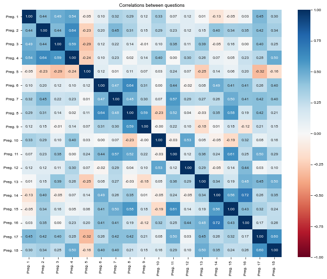

### Loading useful packages


```python
import pandas as pd
import numpy as np
import seaborn as sns

from matplotlib import pyplot as plt
from SettingPLOTs import *
```

### Reading dataset


```python
columns = []
for ii in range(1,19):
    columns.append(f'Preg. {ii}')

def load_data(fname):
    dRaw = pd.read_csv(fname)
    dRaw.drop(['Carimbo de data/hora'], axis=1, inplace=True)
    dRaw.columns = columns
    return dRaw
```


```python
# Grupo control
cpre = load_data('Grupo control - Preprueba.csv')
cpos = load_data('Grupo control - Posprueba.csv')

# Grupo experimental
epre = load_data('Grupo experimental - Preprueba.csv')
epos = load_data('Grupo experimental - Posprueba.csv')

epre.head(2)
```


<div>
<style scoped>
    .dataframe tbody tr th:only-of-type {
        vertical-align: middle;
    }

    .dataframe tbody tr th {
        vertical-align: top;
    }

    .dataframe thead th {
        text-align: right;
    }
</style>
<table border="1" class="dataframe">
  <thead>
    <tr style="text-align: right;">
      <th></th>
      <th>Preg. 1</th>
      <th>Preg. 2</th>
      <th>Preg. 3</th>
      <th>Preg. 4</th>
      <th>Preg. 5</th>
      <th>Preg. 6</th>
      <th>Preg. 7</th>
      <th>Preg. 8</th>
      <th>Preg. 9</th>
      <th>Preg. 10</th>
      <th>Preg. 11</th>
      <th>Preg. 12</th>
      <th>Preg. 13</th>
      <th>Preg. 14</th>
      <th>Preg. 15</th>
      <th>Preg. 16</th>
      <th>Preg. 17</th>
      <th>Preg. 18</th>
    </tr>
  </thead>
  <tbody>
    <tr>
      <th>0</th>
      <td>Informado</td>
      <td>Si conozco</td>
      <td>Conozco un poco</td>
      <td>Muy informado</td>
      <td>Muy de acuerdo</td>
      <td>Algunas veces</td>
      <td>Algunas veces</td>
      <td>Indiferente</td>
      <td>Casi siempre</td>
      <td>Muy de acuerdo</td>
      <td>Nunca</td>
      <td>Muy de acuerdo</td>
      <td>Algunas veces</td>
      <td>Casi siempre</td>
      <td>Nunca</td>
      <td>Algunas veces</td>
      <td>Algunas veces</td>
      <td>Casi siempre</td>
    </tr>
    <tr>
      <th>1</th>
      <td>Informado</td>
      <td>Si conozco</td>
      <td>Indiferente</td>
      <td>Muy informado</td>
      <td>De acuerdo</td>
      <td>Algunas veces</td>
      <td>Algunas veces</td>
      <td>Algunas veces</td>
      <td>Indiferente</td>
      <td>Muy de acuerdo</td>
      <td>Nunca</td>
      <td>De acuerdo</td>
      <td>Indiferente</td>
      <td>Casi siempre</td>
      <td>Algunas veces</td>
      <td>Indiferente</td>
      <td>Casi siempre</td>
      <td>Casi siempre</td>
    </tr>
  </tbody>
</table>
</div>


### Defining counts and percents


```python
def data_stats(data, question, category):
    quest = f'Preg. {question}'
    sort = [s for s in sorter[category] if s in data[quest].unique()]
    idx = data[quest].value_counts().loc[sort[::-1]].index
    count = data[quest].value_counts().loc[sort[::-1]]
    return idx, count
```


```python
sorter = [['Muy informado', 'Informado', 'Indiferente', 'Poco informado', 'Nada informado'],
          ['Conozco mucho', 'Si conozco', 'Indiferente', 'Conozco un poco', 'No conozco nada'],
          ['Muy de acuerdo', 'De acuerdo', 'Indiferente', 'En desacuerdo', 'Muy en desacuerdo'],
          ['Siempre', 'Casi siempre', 'Indiferente', 'Algunas veces', 'Nunca']]


def plot_bar(question, savefig=False):
    
    for category, items in enumerate(sorter):
        items = set(items)
        if set(cpre[f'Preg. {question}'].unique()).issubset(items)==True:
            break
    
    cpre_idx, cpre_count = data_stats(cpre, question, category)
    cpos_idx, cpos_count = data_stats(cpos, question, category)
    epre_idx, epre_count = data_stats(epre, question, category)
    epos_idx, epos_count = data_stats(epos, question, category)
    
    fig, ax = plt.subplots(ncols=2, figsize=cm2inch(15, 2), sharey=True)

    cpre_color, cpos_color = 'cornflowerblue', 'tomato'
    cpre_bars = ax[0].barh(cpre_idx, -cpre_count, color=cpre_color, label='Preprueba')
    cpos_bars = ax[0].barh(cpos_idx, cpos_count, color=cpos_color, label='Posprueba')

    epre_color, epos_color = 'cornflowerblue', 'tomato'
    epre_bars = ax[1].barh(epre_idx, -epre_count, color=epre_color, label='Preprueba')
    epos_bars = ax[1].barh(epos_idx, epos_count, color=epos_color, label='Posprueba')

    def show_percents(name_bars, δ):
        """
        Attach a text label above each bar in *name_bars*, displaying its percent.
        """
        global total
        total = 0
        for p in name_bars:
            total = total + p.get_width()

        for p in name_bars:
            width = p.get_width()
            plt.text(p.get_width()+δ, p.get_y()+0.5*p.get_height(), '{:.1f} %'.format(round((p.get_width()/total)*100, 2)), ha='center', va='center', fontsize=7)

    show_percents(cpre_bars, δ=-64)
    show_percents(cpos_bars, δ=-55.5)

    show_percents(epre_bars, δ=-4)
    show_percents(epos_bars, δ=4.5)

    N=total

    ax[0].set_xlim(-N, N)
    ax[0].set_xlabel('Frecuencia')
    ax[0].set_title('Grupo control', loc='center', y=1.4)
    ax[0].legend(loc='upper center', bbox_to_anchor=(0.5, 1.5), ncol=2, frameon=False)

    ax[1].set_xlim(-N, N)
    ax[1].set_xlabel('Frecuencia')
    ax[1].set_title('Grupo experimental', loc='center', y=1.4)
    ax[1].legend(loc='upper center', bbox_to_anchor=(0.5, 1.5), ncol=2, frameon=False)

    sns.despine(offset=5, trim=True)
    ax[0].set_xticks([-20, -10, 0, 10, 20])
    ax[0].set_xticklabels(['20', '10', '0', '10', '20'])
    ax[1].set_xticks([-20, -10, 0, 10, 20])
    ax[1].set_xticklabels(['20', '10', '0', '10', '20'])

    if savefig==True: plt.savefig(f'Pregunta {question} - Gráfico de barras.svg')
    plt.show()
```


```python
# for jj in range(1,cpre.shape[1]+1):
#     print(f'Pregunta {jj}')
#     plot_bar(question=jj, savefig=False)
```

### Encoding survey options to a Linker scale


```python
def Lscale(x):
    A = []
    for ii in range(len(sorter)): A.append(sorter[ii][x])
    return set(A)

def encode_opt(x):
    """
    Takes a string indicating opt and encodes it to an ordinal (numerical) variable.
    """
    if x in Lscale(0): x = 5
    if x in Lscale(1): x = 4
    if x in Lscale(2): x = 3
    if x in Lscale(3): x = 2
    if x in Lscale(4): x = 1
    
    return x

def Tab2Liker(data):
    encoded = data.copy()
    for column in data.columns:
        encoded[column] = data[column].map(encode_opt)
    return encoded
```


```python
cpre_liker = Tab2Liker(cpre)
cpos_liker = Tab2Liker(cpos)
epre_liker = Tab2Liker(epre)
epos_liker = Tab2Liker(epos)
```

### Cronbach coefficients

$$\alpha = \frac{k}{k-1}\left[\frac{\sigma_\tau^2-\sum^k_{i=1}\sigma_i^2}{\sigma_\tau^2}\right]$$

$$\alpha = \frac{p}{p-1}\frac{\sum\sum_{j\neq k}\sigma_{jk}}{\sum\sum_{j,k}\sigma_{jk}}$$


```python
def αCronbach(data):
    data_liker = Tab2Liker(data)
    k = data_liker.shape[1]
    σi2 = data_liker.var()
    στ2 = data_liker.sum(axis=1).var()
    print(k, sum(σi2), στ2)
    return k/(k-1)*(στ2-sum(σi2))/στ2
```


```python
αCronbach(epre)
```

    18 15.393333333333334 85.91666666666667


    0.869118502881269


---
---
### Cronbach using correlation


```python
# Use Spearman instead of default Pearson, since these are ordinal variables!
corr_matrix = epre_liker.corr(method='spearman')

fig, ax = plt.subplots(figsize=(10, 8))

sns.heatmap(corr_matrix, cmap='RdBu', annot=True, fmt='.2f', vmin=-1, vmax=1)

plt.title("Correlations between questions")

plt.tight_layout()
plt.show()
```


    

    


```python
print('Diagonal (sum): ', np.trace(corr_matrix))
print('All elements (sum): ', np.matrix(corr_matrix).sum())
```

    Diagonal (sum):  18.0
    All elements (sum):  86.51247566616627


```python
Σdiag = np.trace(corr_matrix)
Σall = np.matrix(corr_matrix).sum()
Σelem = (Σall - Σdiag)/2
```


```python
p = Σelem/corr_matrix.shape[0]
N = corr_matrix.shape[0]
```

$$\alpha = \frac{p}{p-1}\frac{\sum\sum_{j\neq k}\sigma_{jk}}{\sum\sum_{j,k}\sigma_{jk}}$$


```python
αC = N*p/(1+p*(N-1))
αC
```


    1.0270776616946375


